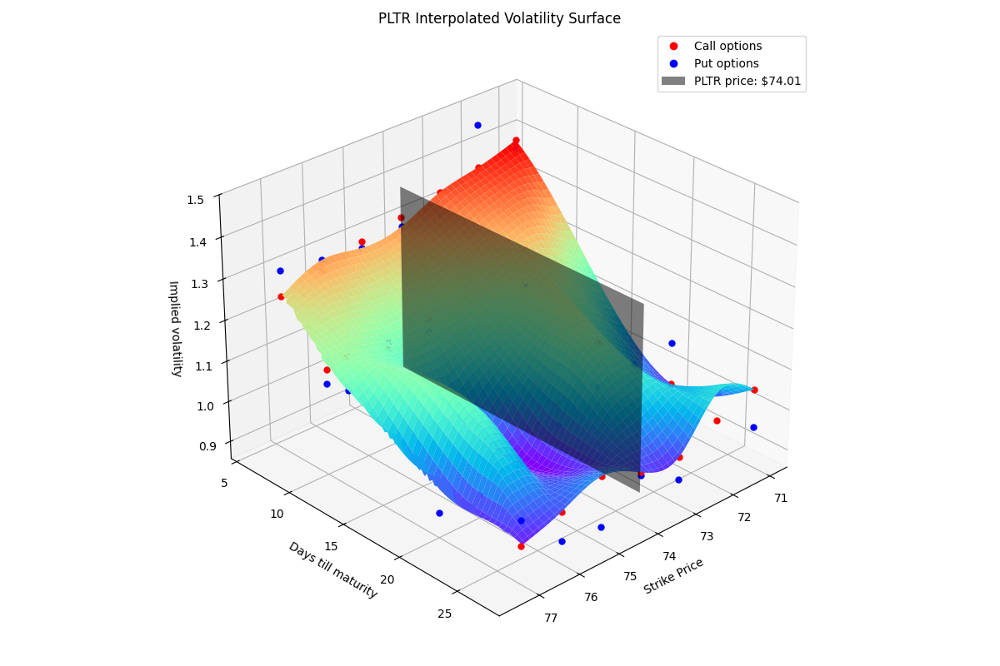
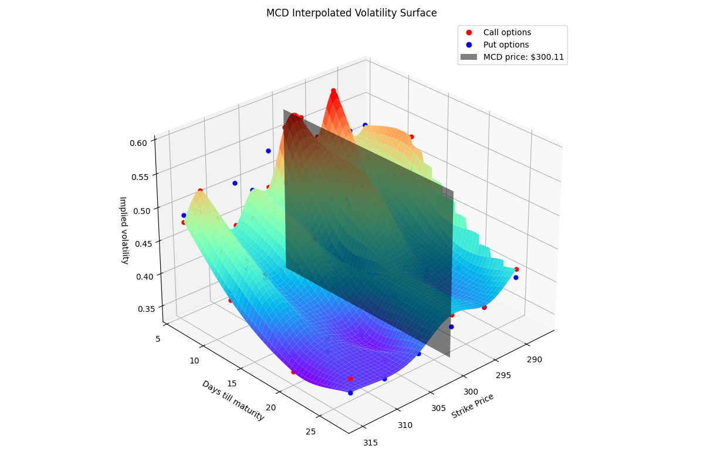

# Volatility Surface Analysis and Option Trading
This document explores the correlation between an option's position on the volatility surface (and therefore its gradient) and which side (buyer or seller of said option) leads to faster in-the-money outcomes.

## Premise:
* **Long Option:** The value of a long option is positively correlated with changes in implied volatility. As implied volatility increases, the option's value tends to rise.
* **Short Option:** Conversely, the value of a short option is negatively correlated with changes in implied volatility. Stable or decreasing volatility benefits the option writer.
* **Gradient as Sensitivity:** The gradient of the volatility surface at an option's strike and time to maturity represents the option's sensitivity to changes in implied volatility. In simpler terms, it indicates how much the option's price will change for a given change in implied volatility.

## Hypothesis:
* **Sensitivity** **Comparison:** If the absolute value of the gradient of the long option's position is less than the absolute value of the gradient of the short option's position (i.e., |Gradient(Long)| < |Gradient(Short)|), it indicates that the short option's position is more sensitive to changes in implied volatility than the long option's position.

## Disclaimer
This information is for educational purposes only and should not be considered financial advice. Options trading involves significant risk and may not be suitable for all investors. Always consult with a qualified financial advisor before making any investment decisions.

---
**Palantir Technologies Inc - NASDAQ: PLTR**

**McDonald's Corp - NYSE: MCD**

